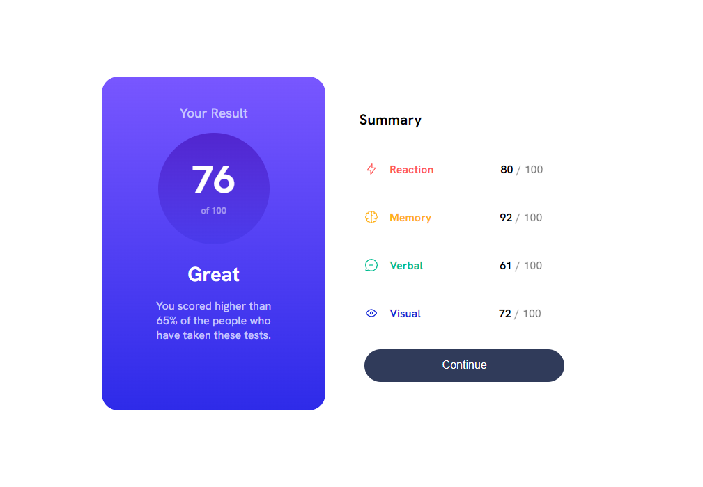

# Frontend Mentor - Results Summary

The fourth project for [Frontend Mentor](https://www.frontendmentor.io/), was a quite challenging project, learned alot, looking forward to learn more.

### Live Example

- [Go to Live Example](https://results-summary-frontendmentor-zuhaz.netlify.app/)

### Screenshot

### What I learned

Learned about background-image property, linear-gradient(), etc

### Built with

- Semantic HTML5 markup
- Cascading Style Sheet (Css)
- Responsive Design
- Media Query
- Background Image
